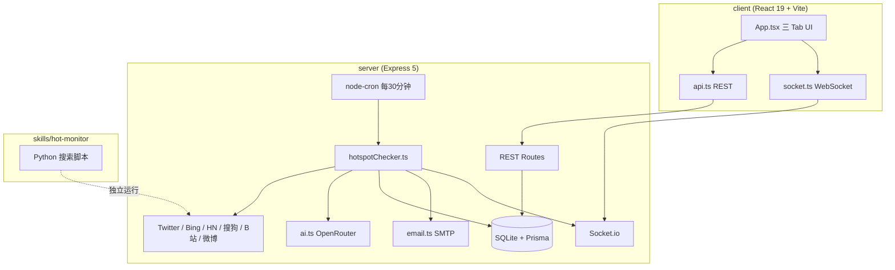

# AI 热点监控工具 — 功能与实现说明

> 本文档描述 **yupi-hot-monitor** 项目的完整功能清单、架构设计与各模块实现方式，便于阅读代码与二次开发。

---

## 一、项目定位

这是一个 **前后端分离** 的全栈项目：从多个数据源抓取内容，经 **OpenRouter（DeepSeek）** 做 AI 分析，再通过 **Web 界面 + WebSocket + 邮件** 推送给用户；另外提供 **Agent Skills** 技能包，供 Cursor、VSCode Copilot、Claude Code 等 AI 工具在不启动 Web 服务的情况下直接使用搜索能力。

**技术栈概览：**

| 层级 | 技术 |
|------|------|
| 前端 | React 19、Vite、React Router、Tailwind CSS 4、Framer Motion、Aceternity UI |
| 后端 | Express 5、Socket.io、node-cron |
| 数据 | SQLite + Prisma（Keyword / Hotspot / Notification / Setting） |
| AI | `@openrouter/sdk`，默认模型 `deepseek/deepseek-v3.2` |
| 开发代理 | Vite 将 `/api`、`/socket.io` 代理到 `http://localhost:3001` |

---

## 二、整体架构



### 架构图说明

上图描述的是：**浏览器里的前端（client）如何与后端（server）协作**。可以把它理解成「一个网页 App + 两条和后端通信的通道」。

#### 前端：`client (React 19 + Vite)`

| 名词 | 含义 |
|------|------|
| **React 19** | 负责画界面、响应点击、展示热点列表等 |
| **Vite** | 开发时启动页面、打包前端代码的工具 |

你在浏览器里打开的热点监控页面，就是这一层。

#### 中间层：`App.tsx`（三 Tab UI）

`App.tsx` 是主界面文件，整个 UI 都在这里。图中的「三 Tab UI」指页面顶部的三个标签页：

| Tab | 功能 |
|-----|------|
| **热点雷达** | 统计卡片、筛选排序、热点流、分页、「立即扫描」 |
| **监控词** | 添加 / 开关 / 删除要监控的关键词 |
| **搜索** | 即时搜索 + 客户端筛选排序 |

`App.tsx` 只负责展示和交互，不直接访问数据库；需要数据或实时推送时，通过下面两个文件与后端通信。

#### 两条通道：`api.ts` 与 `socket.ts`

| 文件 | 协议 | 工作方式 | 类比 |
|------|------|----------|------|
| **`api.ts`** | REST（HTTP） | 用户操作或加载页面时，前端**主动请求**一次后端 | 打电话问一句：「现在有多少条热点？」问完就挂 |
| **`socket.ts`** | WebSocket（Socket.io） | 浏览器与后端**保持长连接**；有新热点或通知时，后端**主动推送**到页面 | 微信一直在线，对方一发消息立刻看到 |

常见分工：

- **`api.ts`**：拉取关键词、热点列表、统计、通知；手动触发扫描；增删改关键词等。
- **`socket.ts`**：订阅监控词；接收 `newHotspot`、`notification` 等实时事件，无需刷新页面。

开发环境下，Vite 会把 `/api` 和 `/socket.io` **代理**到 `http://localhost:3001` 的后端，因此浏览器只访问前端地址，数据实际来自 server。

#### 数据流（简图）

```
用户操作的网页 (App.tsx)
    ├── api.ts     →  需要数据时「去问」后端 (REST Routes)
    └── socket.ts  →  一直连着，后端「主动推」给你 (Socket.io)
                              ↓
                    server：抓热点、AI 分析、存库、发邮件
```

**一句话：** 前端负责**看和操作**；后端负责**抓热点、AI 分析、存数据库、发邮件、推送通知**。图中从 `api.ts`、`socket.ts` 向下连出的线，就是连到右侧 `server` 子图里的 `REST Routes` 与 `Socket.io`。

**目录结构（实际）：**

```
yupi-hot-monitor/
├── client/                 # 前端（见 client/FRONTEND.md）
│   └── src/
│       ├── pages/          # Dashboard、Keywords、Search、Settings
│       ├── layouts/        # AppLayout
│       ├── context/        # AppContext
│       ├── hooks/          # useHotspots、useToast
│       ├── components/     # HotspotCard、Header、Nav 等
│       ├── services/       # api.ts、socket.ts
│       └── utils/
├── server/                 # 后端
│   └── src/
│       ├── index.ts        # 入口、路由挂载、cron、Socket.io
│       ├── routes/         # keywords、hotspots、settings、notifications
│       ├── services/       # search、chinaSearch、twitter、ai、email
│       ├── jobs/           # hotspotChecker.ts（核心流水线）
│       └── utils/          # sortHotspots
├── skills/hot-monitor/     # Agent Skills（Python 脚本 + SKILL.md）
└── docs/                   # 项目文档
```

---

## 三、六大核心功能与实现

### 1. 关键词监控（激活 / 暂停）

**功能说明：** 用户配置要监控的关键词，支持开启、暂停、删除；只有 `isActive: true` 的关键词会参与定时扫描。

**实现方式：**

| 环节 | 位置 | 说明 |
|------|------|------|
| 数据模型 | `server/prisma/schema.prisma` → `Keyword` | `text` 唯一、`isActive` 默认 true，关联 `Hotspot` |
| REST API | `server/src/routes/keywords.ts` | `GET/POST/PUT/DELETE`，`PATCH /:id/toggle` 切换状态 |
| 前端 UI | `client/src/App.tsx` →「监控词」Tab | 调用 `keywordsApi` |
| WebSocket 订阅 | `client/src/services/socket.ts` | 新增关键词后 `subscribeToKeywords([text])` |
| 定时扫描 | `server/src/index.ts` | `cron.schedule('*/30 * * * *')` 调用 `runHotspotCheck(io)` |
| 手动触发 | `POST /api/check-hotspots` | 前端「立即扫描」按钮 |

---

### 2. 多源抓取 + AI 分析（核心流水线）

**功能说明：** 对每个激活关键词，从多个平台并行拉取内容，经去重、新鲜度过滤、配额控制后，由 AI 判断真假与相关性，达标则入库并触发通知。

**主流程：** `server/src/jobs/hotspotChecker.ts` → `runHotspotCheck(io)`

| 步骤 | 实现 | 相关文件 |
|------|------|----------|
| 1. 读取激活词 | `prisma.keyword.findMany({ where: { isActive: true } })` | `hotspotChecker.ts` |
| 2. 账号识别 | `detectAndFetchAccount(keyword)`：若关键词像 B 站 UP 主等，先拉账号最新内容 | `services/chinaSearch.ts` |
| 3. 查询扩展 | `expandKeyword()`：AI 生成 5–15 个检索变体，内存缓存 | `services/ai.ts` |
| 4. 并行搜索 | `Promise.allSettled` 同时请求 6 个源 | 见下表 |
| 5. 清洗排序 | 去重 → 7 天内新鲜度 → 来源优先级（Twitter 优先） | `hotspotChecker.ts` |
| 6. 配额处理 | Twitter 最多 15 条，其它源共 10 条；`url+source` 已存在则跳过 | `hotspotChecker.ts` |
| 7. AI 分析 | `analyzeContent()` + `preMatchKeyword()` | `services/ai.ts` |
| 8. 入库门槛 | 见下方「过滤规则」 | `hotspotChecker.ts` |
| 9. 通知 | 写 Notification、WebSocket、高优先级邮件 | `hotspotChecker.ts`、`email.ts` |

**定时任务使用的数据源：**

| 来源 | 实现文件 | 抓取方式 |
|------|----------|----------|
| Twitter/X | `services/twitter.ts` | [twitterapi.io](https://twitterapi.io)，高级搜索 + 质量过滤（点赞/转发/粉丝阈值） |
| Bing | `services/search.ts` | axios + cheerio 解析 HTML |
| Hacker News | `services/search.ts` | Algolia HN API（`hn.algolia.com`），近 24 小时 |
| 搜狗 | `services/chinaSearch.ts` | HTML 爬虫 |
| Bilibili | `services/chinaSearch.ts` | 搜索 API + 可选用户内容 |
| 微博热搜 | `services/chinaSearch.ts` | 热搜/话题抓取 |

> 代码中还实现了 **Google、DuckDuckGo** 搜索（`search.ts`），用于手动聚合或 Skills 脚本，**默认定时任务未启用**。

**AI 分析内容**（`services/ai.ts`）：

1. **Query Expansion（查询扩展）** — 生成关键词变体，提高文本预匹配召回率  
2. **preMatchKeyword** — 不区分大小写检查正文是否含变体  
3. **analyzeContent** — 输出 JSON：
   - `isReal`：是否真实有价值（排除标题党、假新闻）
   - `relevance`：与监控词相关性 0–100
   - `relevanceReason`：打分理由
   - `keywordMentioned`：是否直接提及关键词
   - `importance`：`low` / `medium` / `high` / `urgent`
   - `summary`：与关键词关联的一句话摘要

**入库过滤规则：**

- `isReal === false` → 丢弃  
- `relevance < 50` → 丢弃  
- 未直接提及关键词且 `relevance < 65` → 丢弃  

**来源优先级（处理顺序）：** Twitter > 微博 > B站 > HackerNews > 搜狗 > Bing > Google > DuckDuckGo

---

### 3. 多维度筛选与排序

**功能说明：** 按来源、重要性、监控词、时间范围、真实性筛选；按创建时间、发布时间、相关性、重要性、热度排序。

**实现方式：**

| 场景 | 实现 |
|------|------|
| 仪表盘热点列表 | `GET /api/hotspots` + 查询参数；服务端 Prisma `where` + `orderBy` |
| 重要性 / 热度排序 | Prisma 无法自定义枚举顺序时，用 `server/src/utils/sortHotspots.ts` 内存排序后分页 |
| 前端筛选条 | `client/src/components/FilterSortBar.tsx` |
| 仪表盘 | `dashboardFilters` 传给 API |
| 搜索 Tab | 结果在客户端 `useMemo` 中二次筛选（`client/src/utils/sortHotspots.ts`） |
| 热度综合分 | `App.tsx` 中 `calcHeatScore()`：点赞、转发、回复、评论、引用、浏览加权，log 压缩到 0–100 |

**时间范围选项：** `1h` / `today` / `7d` / `30d`

---

### 4. 全网即时搜索

**功能说明：** 不依赖数据库已有记录，用户输入关键词即时搜索（与定时监控独立）。

**实现方式：**

- **API：** `POST /api/hotspots/search`，body：`{ query, sources?: ['twitter','bing', ...] }`
- **逻辑：** `server/src/routes/hotspots.ts` — 拉取 Twitter + Bing（按 `sources`），对前 10 条调用 `analyzeContent`，返回带 `analysis` 字段的结果
- **前端：**「搜索」Tab → `hotspotsApi.search()` → 客户端筛选展示
- **注意：** 即时搜索 **不写入数据库**；当前接口默认源少于定时任务的 6 源

---

### 5. 实时通知（WebSocket + 邮件）

**功能说明：** 新热点推送到浏览器；高/紧急重要性发邮件。

| 通道 | 实现 |
|------|------|
| **WebSocket** | `server/src/index.ts`：客户端 `subscribe` 加入房间 `keyword:${关键词}`；新热点 `emit('hotspot:new', hotspot)`；全局 `emit('notification', ...)` |
| **前端 Socket** | `client/src/services/socket.ts`：连接同源（Vite 代理 `/socket.io`）；`onNewHotspot` 插入列表 + Toast |
| **站内通知** | `Notification` 表 + `server/src/routes/notifications.ts`；铃铛面板、全部已读 |
| **邮件** | `server/src/services/email.ts` + nodemailer；仅 `importance` 为 `high` 或 `urgent` 时 `sendHotspotEmail`；需配置 `SMTP_*`、`NOTIFY_EMAIL` |

**WebSocket 事件约定：**

```
客户端 → 服务端：subscribe(keywords[])、unsubscribe(keywords[])
服务端 → 客户端：hotspot:new、notification
```

---

### 6. Agent Skills 技能包

**功能说明：** 无需启动 Web 服务，在 AI IDE 中通过 Python 脚本做多源搜索，由宿主 AI 自行分析报告。

**位置：** `skills/hot-monitor/`

| 文件 | 作用 |
|------|------|
| `SKILL.md` | 技能元数据、触发场景、工作流说明 |
| `scripts/search_web.py` | Bing、Google、DuckDuckGo、HackerNews |
| `scripts/search_china.py` | 搜狗、Bilibili、微博 |
| `scripts/search_twitter.py` | Twitter（需 `TWITTER_API_KEY`） |
| `scripts/generate_report.py` | 报告生成 |
| `references/analysis-guide.md` | AI 分析评判标准 |
| `references/search-sources.md` | 数据源说明 |

与 Web 版 **共享数据源设计**，但 **无 SQLite、无 Socket.io、无定时任务**，分析由 Cursor/Copilot 等内置模型完成。

---

## 四、前端页面结构

主界面为单文件 `client/src/App.tsx`，三个 Tab：

| Tab | 功能 |
|-----|------|
| **热点雷达** | 统计卡片（总数/今日/紧急/监控词数）、筛选排序条、热点流、分页、「立即扫描」 |
| **监控词** | 添加、开关、删除关键词 |
| **搜索** | 即时搜索 + 客户端筛选排序 |

**UI 风格：** 暗色主题 + Aceternity UI（`BackgroundBeams`、`Spotlight`、`Meteors` 等）。

**数据加载：** `loadData()` 并行请求 keywords、hotspots、stats、notifications；筛选变化时重置页码。

---

## 五、REST API 一览

```
GET    /api/health                  # 服务健康 + OpenRouter/SMTP 状态
GET    /api/health/sources          # 数据源连通性（?refresh=true 强制检测）
GET    /api/health/ai-stats         # AI 调用统计
POST   /api/check-hotspots          # 手动触发扫描（409 若已在运行）
GET    /api/scan/status             # 扫描状态、过滤统计、AI 用量、源健康缓存

GET    /api/keywords
POST   /api/keywords
GET    /api/keywords/:id
PUT    /api/keywords/:id
DELETE /api/keywords/:id
PATCH  /api/keywords/:id/toggle

GET    /api/hotspots                # 支持分页与筛选 query
GET    /api/hotspots/stats
GET    /api/hotspots/:id
POST   /api/hotspots/search
DELETE /api/hotspots/:id

GET    /api/settings
PUT    /api/settings
GET    /api/settings/:key
PUT    /api/settings/:key

GET    /api/notifications
PATCH  /api/notifications/:id/read
PATCH  /api/notifications/read-all
DELETE /api/notifications/:id
DELETE /api/notifications
```

开发环境下前端通过 `client/vite.config.ts` 将 `/api` 代理到后端；生产环境需自行配置 Nginx 等反向代理。

---

## 六、数据模型（Prisma）

### Keyword

| 字段 | 说明 |
|------|------|
| id | UUID |
| text | 关键词（唯一） |
| category | 可选分类 |
| isActive | 是否参与定时扫描 |
| hotspots | 关联热点列表 |

### Hotspot

| 字段 | 说明 |
|------|------|
| title, content, url | 基础内容 |
| source | 来源标识：twitter, bing, hackernews, sogou, bilibili, weibo 等 |
| sourceId | 原始平台 ID（如推文 ID） |
| isReal, relevance, relevanceReason, keywordMentioned | AI 分析结果 |
| importance | low / medium / high / urgent |
| summary | AI 摘要 |
| viewCount, likeCount, retweetCount, … | 各平台互动数据 |
| authorName, authorUsername, … | 作者信息 |
| publishedAt, createdAt | 发布时间与入库时间 |
| keywordId | 关联监控词 |

**唯一约束：** `@@unique([url, source])` 防止重复入库。

### Notification

站内通知记录：`type`、`title`、`content`、`isRead`、`hotspotId`。

### Setting

键值对配置：`scanIntervalMinutes`、`emailNotificationsEnabled`、`enabledSources`；前端 **设置 Tab** 可编辑。

---

## 七、环境变量

| 变量 | 必需 | 说明 |
|------|------|------|
| `OPENROUTER_API_KEY` | **是** | AI 查询扩展与内容分析 |
| `DATABASE_URL` | 是 | SQLite 连接串 |
| `TWITTER_API_KEY` | 否 | Twitter 数据源 |
| `SMTP_HOST` / `SMTP_PORT` / `SMTP_USER` / `SMTP_PASS` | 否 | 邮件发送 |
| `SMTP_SECURE` | 否 | 是否 TLS |
| `NOTIFY_EMAIL` | 否 | 接收通知的邮箱 |
| `CLIENT_URL` | 否 | Socket.io CORS，默认 `http://localhost:5173` |
| `PORT` | 否 | 后端端口，默认 3001 |

模板见 `server/.env.example`。

---

## 八、核心代码文件索引

| 职责 | 文件路径 |
|------|----------|
| 服务入口 | `server/src/index.ts` |
| 定时扫描流水线 | `server/src/jobs/hotspotChecker.ts` |
| AI 服务 | `server/src/services/ai.ts` |
| 国际搜索 | `server/src/services/search.ts` |
| 国内搜索 | `server/src/services/chinaSearch.ts` |
| Twitter | `server/src/services/twitter.ts` |
| 邮件 | `server/src/services/email.ts` |
| 热点路由 | `server/src/routes/hotspots.ts` |
| 关键词路由 | `server/src/routes/keywords.ts` |
| 前端主界面 | `client/src/App.tsx` |
| API 客户端 | `client/src/services/api.ts` |
| WebSocket 客户端 | `client/src/services/socket.ts` |
| Agent Skill | `skills/hot-monitor/SKILL.md` |

---

## 九、测试与其它

- **单元测试：** `server/src/__tests__/sortHotspots.test.ts`、`aiRelevance.test.ts`（`npm test`）
- **数据源调试：** `server/src/test-sources.ts`
- **相关文档：**
  - [功能矩阵](./FEATURE_MATRIX.md)
  - [项目完善规划](./项目完善规划.md)
  - [本地运行指南](./LOCAL_SETUP.md)
  - [需求文档](./REQUIREMENTS.md)
  - [API 集成说明](./API_INTEGRATION.md)
  - [项目根 README](../README.md)

---

## 十、端到端数据流总结

```
用户添加关键词 (isActive=true)
        ↓
每 30 分钟 cron / 手动 POST /api/check-hotspots
        ↓
hotspotChecker：扩展关键词 → 6 源并行抓取 → 去重/过滤/配额
        ↓
每条新结果：preMatch + analyzeContent (OpenRouter)
        ↓
通过阈值 → 写入 Hotspot + Notification
        ↓
Socket.io 推送 hotspot:new + notification
        ↓
importance 为 high/urgent → SMTP 邮件
        ↓
前端热点雷达展示 / 铃铛通知 / Toast
```

**即时搜索路径：** 用户输入 → `POST /api/hotspots/search` → Twitter/Bing + AI → 前端展示（不入库）

**Agent Skills 路径：** 用户向 AI 提问 → 执行 Python 脚本 → JSON 结果 → 宿主 AI 按 analysis-guide 分析并输出报告

---

*文档随代码演进可能略有差异，以仓库实际实现为准。*
